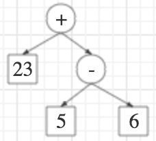
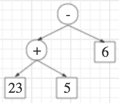

# 2 本书有关语法分析的一切

语法分析（parsing）是将输入字符流转换成结构化内部表示的过程。常见的内部表示是树 ，可以使用程序递归的处理树这种数据结构。例如，给定输入流：

```text
23 + 5 - 6
```

我们可以将其转换成一颗根节点为加法，左边节点表示数字 `23` ，右边节点是用树表示 `5-6` 的树。语法分析机器（parser）是用于实现这种转换的程序。



语法分析本身是一个比较复杂，且由于歧义的存在，还远没有被解决的问题。例如上面的例子，你还可以将其转换成根节点为减法，左边为表示 `23+5` 的树，右边为数字 `6` 的树。



我们还需要考虑操作符（ `+` ， `-` ）的优先性、两个操作数的交换性等问题。要解析一个羽翼丰满的语言（说的不是自然语言），要考虑的问题只会越来越多、越来越复杂。

## 2.1 轻量级的，内建的语法分析器的前半部分

这些问题使得语法分析本身适合当作一个单独主题来讲，本书主题不专注于该方面。从我们的角度来说，语法分析是一层抽象，因为我们想学习的是编程语言的各个部分而不是语法分析本身。因此，我们使用 Racket 一个有用的特性来将输入流转换成树：read 。 read 和该语言的括号语法形式紧密关联。它将括号形式转换成内部树形式。运行 `(read)` 然后输入 ——

```racket
(+ 23 (- 5 6))
```

——会产出一个列表，其第一个元素是符号 `'+` ，第二个元素是数字 `23` ，第三个元素是一个列表；该列表其第一个元素是符号 `'-` ，第二个元素是数字 `5` ，第三个元素是数字 `6`。

## 2.2 A Convenient Shortcut

## 2.3 语法分析得到的类型

在 Typed PLAI 中， `(read)` 返回值类型为 s-expression 。

```racket
> (read)
- s-expression
[type in (+ 23 (- 5 6))]
'(+ 23 (- 5 6))
```

## 2.4 写个简单的语法分析器

考虑后面章节算术的表示中对于算术表达式的数据结构定义：

```
(define-type ArithC
  [numC (n : number)]
  [plusC (l : ArithC) (r : ArithC)]
  [multC (l : ArithC) (r : ArithC)])
```

目标是将 racket 给我们初步解析得到 s-expression 解析成该数据类型，代码简单直接：

```racket
(define (parse [s : s-expression])
  (cond
    [(s-exp-number? s) (numC (s-exp->number s))]
    [(s-exp-list? s)
     (let ([sl (s-exp->list s)])
       (case (s-exp->symbol (first sl))
         [(+) (plusC (parse (second sl)) (parse (third sl)))]
         [(*) (multC (parse (second sl)) (parse (third sl)))]
         [else (error 'parse "invalid list input")]))]
    [else (error 'parse "invalid input")]))
```

注意，为简便起见，这里的代码有些东西没有考虑，比如我们只考虑了两位数的加法和乘法，且没有对传入参数的个数进行校验。简单运行如下：

```racket
> (parse (read))
- ArithC
(+ (* 2 3) (+ 3 6))
(plusC (multC (numC 2) (numC 3)) (plusC (numC 3) (numC 6)))
```

到此我们完成一个简单的 parser！虽然它的大部分工作是由 `read` 函数替我们做的，但是我们的代码成功的将输入程序解析成了自己定义的内部表示。

## 2.5 Coda
